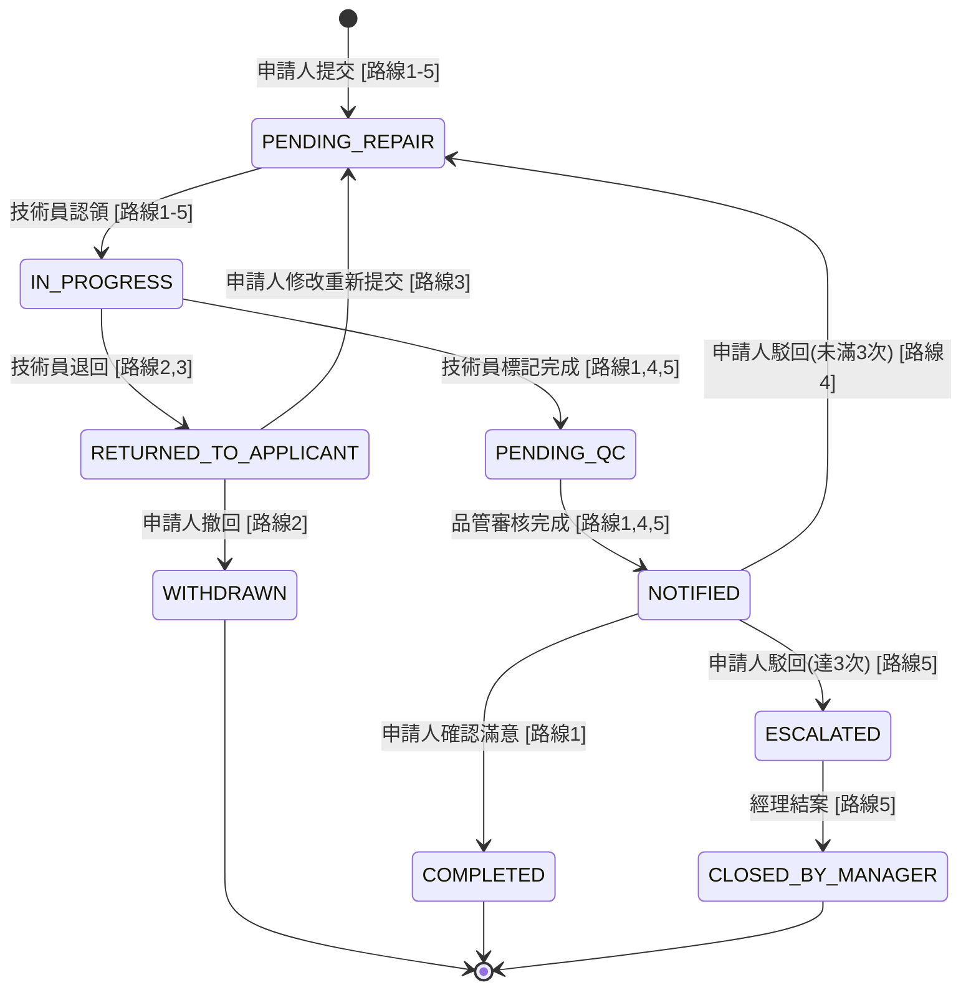
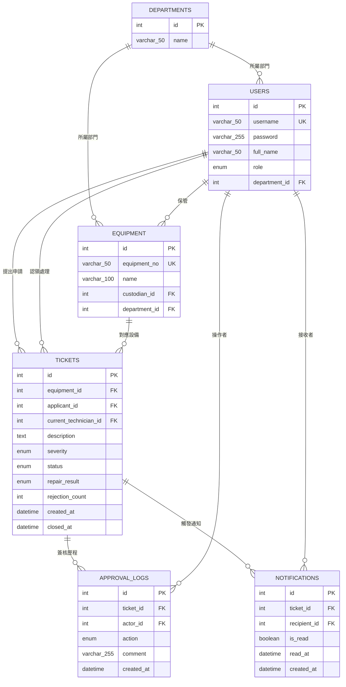
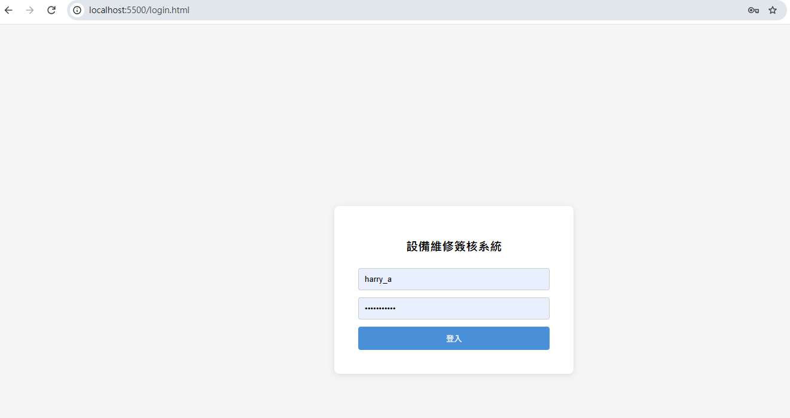
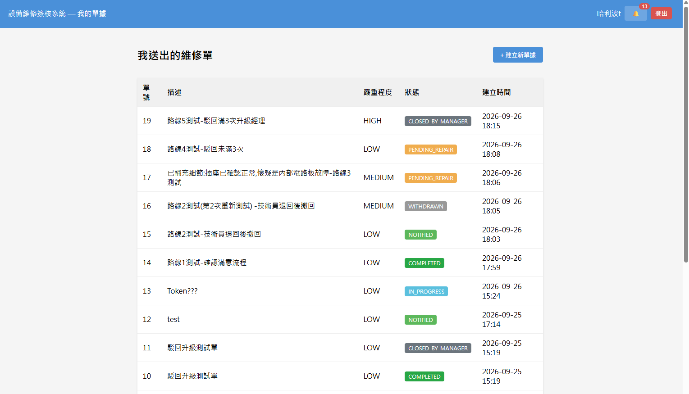
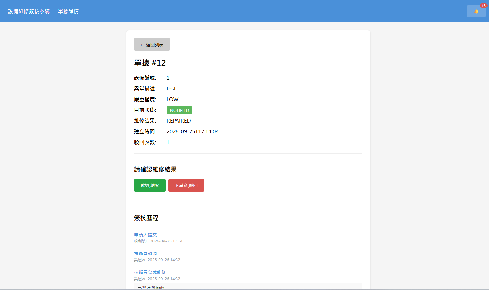
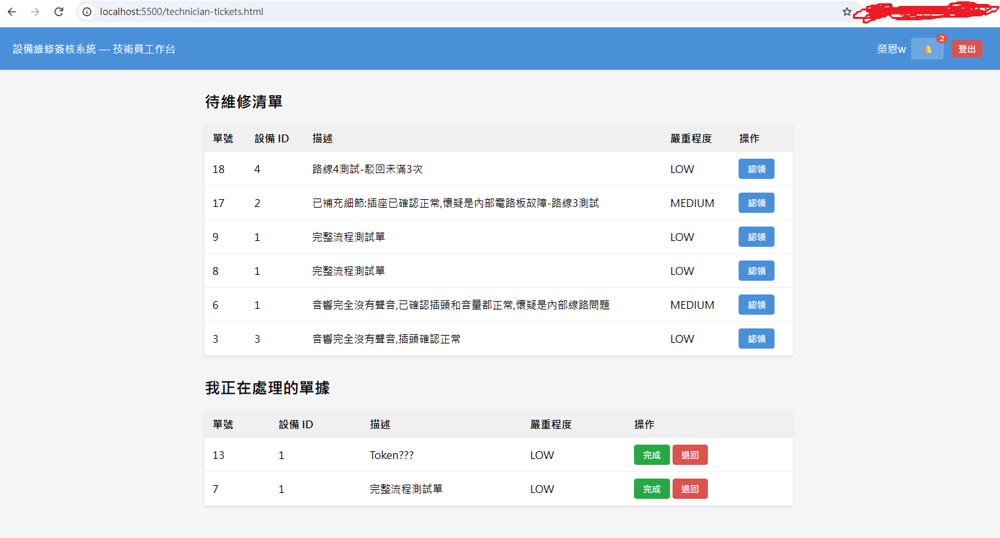
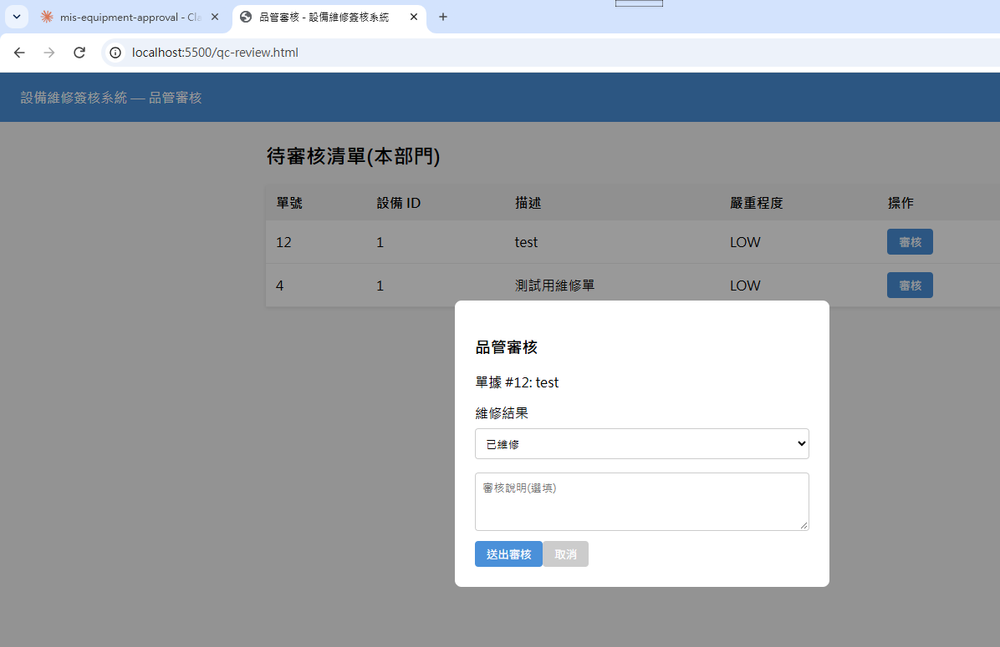
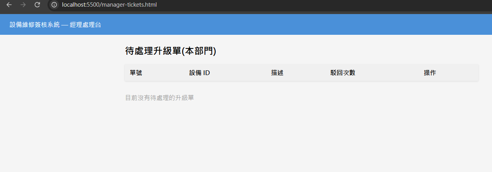

# 設備異常/維修簽核系統(mis-equipment-approval)

## 專案動機

過去擔任測試工程師期間,曾多次遇到測試設備發生異常、需要走維修申請流程的情況。當時的流程仰賴人工紙本及跑流程往返辦公室,從發現異常、通報保管人、等待維修人員排程,到最後品管確認、結案,每個環節都需要手動填寫表單,也因此耗費了一些時間成本。

這段經驗讓我開始思考:是否能將整套流程數位化?因此透過這個 side project,基於過去的實務觀察,嘗試設計並實作出一個範例系統。

## 系統簡介

本系統是一套設備異常/維修簽核系統,模擬企業內部真實的維修申請流程,涵蓋四種角色:**申請人**(發現設備異常、提出申請,並在維修完成後確認結果或提出異議)、**技術員**(認領並處理維修,可標記完成或退回)、**品管**(審核維修結果的品質,判定為已維修或建議報廢)、**經理**(處理申請人對維修結果反覆駁回、升級後的最終爭議案件)。

系統設計了完整的狀態機,涵蓋從申請提交、認領處理、品管審核、申請人確認,到爭議升級與最終結案的 9 種狀態轉換,並針對品管與經理的審核權限,加入部門範圍限制,確保跨部門的資料不會被誤觸。

## 技術棧

**後端**
- Java 25 + Spring Boot 4.1.1
- MySQL 8.4(使用 JdbcTemplate 手寫 SQL,未使用 JPA/Hibernate)
- Spring Security(僅用於 BCrypt 密碼加密)
- 自建 Token 身份驗證機制(登入產生 Token,攔截器驗證,取代傳統 Session)
- Spring Boot DevTools(開發時自動熱重載)

**前端**
- Vue 3(透過 CDN 引入,無建置工具鏈)
- 原生 HTML/CSS/JavaScript

**開發工具**
- Maven
- Git / GitHub

## 系統流程圖



以上流程圖的每一條路線,皆已實際操作驗證,前端、後端與資料庫結果完全一致:

| 路線編號 | 說明 |
|---|---|
| 路線 1 | 提交 → 認領 → 完成 → 品管審核 → 申請人確認 → 結案 |
| 路線 2 | 提交 → 認領 → 技術員退回 → 申請人撤回 |
| 路線 3 | 提交 → 認領 → 技術員退回 → 申請人修改重新提交 |
| 路線 4 | 提交 → 認領 → 完成 → 品管審核 → 申請人駁回(未滿3次)→ 循環 |
| 路線 5 | 提交 → 認領 → 完成 → 品管審核 → 申請人駁回 3 次 → 升級 → 經理結案 |

## ER 圖



## 核心設計決策

| 決策 | 理由 |
|---|---|
| 駁回滿 3 次才升級給經理,不是 1 次或無限次 | 平衡「申請人有申訴空間」與「流程不能無限循環」,3 次是常見的業界慣例折衷點 |
| 品管與經理的審核範圍限定同部門 | 避免跨部門誤觸不熟悉的設備資訊,是最小權限原則的體現 |
| 主管只收知會通知,不參與流程審批 | 簡化流程,同時主管能掌握部門內設備狀況 |
| 採用自建 Token 機制,而非傳統 Session | 前後端分離架構下,Token 不依賴伺服器端保存連線狀態,更適合純 API 形式的後端設計 |
| 前端用 Vue 3 CDN 引入,而非 Vite 建置工具鏈 | 降低開發環境的複雜度與風險,聚焦在核心邏輯與框架語法的掌握 |

## 開發過程中遇到問題及修正

| 問題 | 修正 |
|---|---|
| 系統初期,API 暫時採用前端直接傳遞 `actorId` 的簡化方式辨識操作者身份。實際測試發現,這種方式存在角色冒用風險——例如申請人帳號能成功呼叫僅限品管使用的審核 API | 回頭補上完整的 Token 身份驗證機制與角色權限檢查,確保每一支需要授權的 API 都能正確辨識操作者身份與角色 |
| 前端某個特定檔名(`ticket-detail.html`)持續出現瀏覽器安全限制錯誤,反覆排查後發現是瀏覽器對該檔名有異常快取行為 | 改用不同檔名(`detail.html`)繞開問題,並改用本機網頁伺服器(而非直接開啟檔案)存取前端頁面 |
| 加上 Token 驗證後,瀏覽器發送帶有 Authorization 標頭的請求會觸發 CORS 預檢請求(OPTIONS),原本的攔截器誤判為未授權而擋下 | 在攔截器裡新增判斷,OPTIONS 請求一律放行,不檢查 Token |

## 資料庫改用 MySQL 的原因說明

原先規劃使用 MS SQL Server 作為資料庫,但在環境建置過程中,遇到官方下載節點失效的問題,考量開發時程,改採用 MySQL 8.4。

兩者皆為業界廣泛使用的關聯式資料庫,核心的 SQL 語法邏輯高度相通,以下列出幾個常見語法差異的對照:

| 項目 | T-SQL(MS SQL) | MySQL |
|---|---|---|
| 自動遞增主鍵 | `IDENTITY(1,1)` | `AUTO_INCREMENT` |
| 取得目前時間 | `GETDATE()` | `NOW()` |
| 字串串接 | `+` | `CONCAT()` |
| 限制回傳筆數 | `TOP N` | `LIMIT N` |
| 條件式判斷 | `CASE WHEN ... END` | `CASE WHEN ... END`(語法相同) |
| 布林值型別 | 無原生布林型別,慣用 `BIT` | `BOOLEAN`(實際儲存為 `TINYINT(1)`) |

## API 一覽表

**身份驗證**

| 方法 | 路徑 | 說明 |
|---|---|---|
| POST | `/api/auth/login` | 登入,成功回傳 Token |
| POST | `/api/auth/logout` | 登出,使 Token 失效 |

**維修單流程操作**

| 方法 | 路徑 | 說明 |
|---|---|---|
| POST | `/api/tickets` | 建立維修單(申請人) |
| PATCH | `/api/tickets/{id}/claim` | 認領維修單(技術員) |
| PATCH | `/api/tickets/{id}/resolve` | 標記完成或退回(技術員) |
| PATCH | `/api/tickets/{id}/withdraw` | 撤回申請(申請人) |
| PATCH | `/api/tickets/{id}/resubmit` | 修改後重新提交(申請人) |
| PATCH | `/api/tickets/{id}/qc-review` | 品管審核(品管) |
| PATCH | `/api/tickets/{id}/confirm` | 確認結案(申請人) |
| PATCH | `/api/tickets/{id}/dispute` | 駁回維修結果(申請人) |
| PATCH | `/api/tickets/{id}/manager-close` | 經理結案(經理) |

**查詢**

| 方法 | 路徑 | 說明 |
|---|---|---|
| GET | `/api/tickets` | 彈性查詢維修單清單(支援多條件篩選) |
| GET | `/api/tickets/{id}` | 查詢單一維修單詳情 |
| GET | `/api/tickets/{id}/logs` | 查詢單一維修單的完整簽核歷程 |
| GET | `/api/departments` | 查詢部門清單 |
| GET | `/api/users` | 查詢使用者清單 |
| GET | `/api/equipment` | 查詢設備清單 |

**通知**

| 方法 | 路徑 | 說明 |
|---|---|---|
| GET | `/api/notifications` | 查詢我的通知清單 |
| GET | `/api/notifications/unread-count` | 查詢我的未讀通知數量 |
| PATCH | `/api/notifications/{id}/read` | 標記某筆通知為已讀 |

## 畫面截圖

**登入頁**


**我的單據(申請人視角)**


**單據詳情頁(含簽核歷程)**


**技術員工作台**


**品管審核彈出視窗**


**經理處理台**


## 已知限制

- **Token 儲存於伺服器記憶體**:目前身份驗證的 Token,存放在後端應用程式的記憶體中,並非持久化儲存。這代表每次重新啟動後端服務,所有使用者都需要重新登入。正式環境建議改用 Redis 等外部儲存,或導入標準的 JWT 機制。

- **ADMIN 角色尚未賦予實際功能**:資料庫設計已保留 `ADMIN` 角色,但目前系統尚未實作對應的管理介面(例如使用者帳號啟用/停用、單據強制關閉等),留待未來擴充。

- **前端未使用建置工具鏈**:採用 CDN 引入 Vue 3 的方式開發,這是刻意降低環境複雜度的選擇(詳見核心設計決策),但也因此無法使用單一檔案元件(`.vue`)等現代前端開發模式,所有邏輯集中在單一 HTML 檔案中,檔案較長,可讀性上有取捨空間。

- **假設每個部門至少配置一位品管與一位經理**:若某部門缺少對應角色的使用者,該部門的單據將無法完成品管審核或經理結案,流程會停滯。

- **通知僅支援站內顯示,無 Email / 即時推播**:通知功能僅在使用者登入系統後,透過畫面上的通知鈴鐺呈現,未整合 Email 通知或 WebSocket 即時推播。Email 通知需額外串接郵件伺服器,即時推播則需建立長連線機制,兩者皆屬於獨立的基礎建設,考量本專案聚焦於簽核流程與身份驗證的核心設計,暫不列入開發範圍。

## 如何在本機執行

**環境需求**
- Java 25(或相容版本)
- MySQL 8.4
- 支援 ES6 的現代瀏覽器(Chrome、Edge、Firefox 皆可)

**後端啟動**

1. 使用 `sql/schema.sql` 建立資料庫結構,再匯入 `sql/seed_data.sql` 建立測試資料
2. 修改 `src/main/resources/application.properties`,填入本機 MySQL 的帳號密碼
3. 在專案根目錄執行:
   ```
   .\mvnw.cmd spring-boot:run
   ```
4. 後端啟動後,監聽於 `http://localhost:8080`

**前端啟動**

前端為純 HTML/CSS/JavaScript,需透過本機網頁伺服器開啟(直接以瀏覽器開啟檔案會因安全性限制無法正常運作)。

1. 進入 `frontend` 資料夾
2. 執行:
   ```
   python -m http.server 5500
   ```
3. 瀏覽器開啟 `http://localhost:5500/login.html`

**測試帳號**

| 帳號 | 密碼 | 角色 | 部門 |
|---|---|---|---|
| harry_a | password123 | 申請人 | 資訊部 |
| ron_c | password123 | 技術員 | 資訊部 |
| dumbledore_d | password123 | 品管 | 資訊部 |
| mcgonagall_e | password123 | 經理 | 資訊部 |
| draco_g | password123 | 申請人 | 設備部 |
| neville_i | password123 | 技術員 | 設備部 |
| sirius_j | password123 | 品管 | 設備部 |
| lupin_k | password123 | 經理 | 設備部 |

---

## English Summary

This is a full-stack equipment maintenance approval system built as a personal side project, based on real-world observations from my previous role as a test engineer, where manual paper-based maintenance requests were time-consuming and lacked transparency.

**Tech Stack**: Java 25 + Spring Boot, MySQL (raw SQL via JdbcTemplate), Vue 3 (CDN-based, no build tooling), self-built Token-based authentication.

**Highlights**:
- A 9-state state machine covering the full lifecycle of a maintenance ticket, from submission to final closure, including a dispute-escalation mechanism (auto-escalates to a manager after 3 rejections).
- Role-based access control across 4 roles (Applicant, Technician, QC, Manager), each scoped to their own department where applicable.
- Custom Token authentication with request interceptor, evolved from a simplified `actorId`-passing approach after discovering an authorization bypass vulnerability during testing.
- All 5 possible workflow paths manually verified end-to-end, with results documented in the flowchart above.

GitHub: https://github.com/codingarista/mis-equipment-approval
